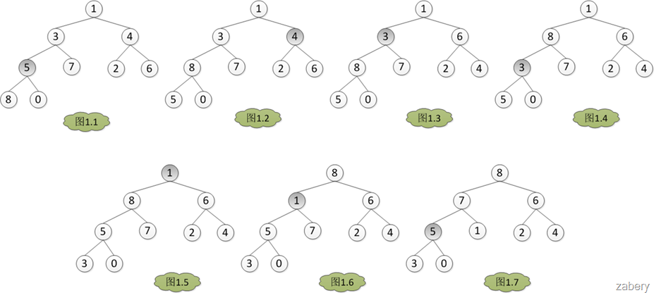
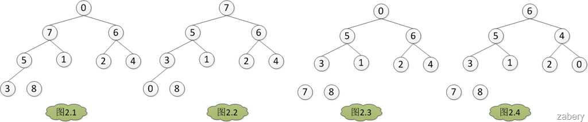
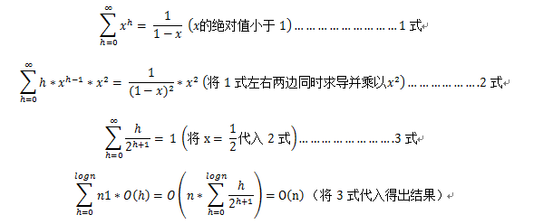

### 堆排序

#### 1. Floyd建堆

建堆的核心是调整堆，使二叉树满足堆的定义（每个节点的值都不大于其父节点的值-最大堆） 
调堆和过程应该从最后一个非叶子节点开始，假设有`A={1, 3, 4, 5, 7, 2, 6, 8, 0}`。那么调堆的过程如图，数组下标从0开始，`A[3]=5`开始。分别与左孩子和又孩子比较大小，如果`A[3]`最大，则不用调整，否则和孩子中的值最大的一个交换位置。
```
for (i = headLen/2; i >= 0; i++)
{
    do AjustHeap(A, heapLen, i);
}
```

### 2. 堆排序


```cpp
void AjustHeap(int A[], int heapLen, int i)
{
    int left = LeftChild(i);
    int right = RightChild(i);
    int largest = i;
    int temp;

    while (left < heapLen || right < heapLen)
    {
        if (left < heapLen && A[largest] < A[left])
        {
            largest = left;
        }

        if (right = heapLen && A[largest] < A[right])
        {
            largest = right;
        }

        if (i != largest)
        {
            temp = A[largest];
            A[largest] = A[i];
            A[i] = temp;

            i = largest;
            left = LeftChild(i);
            right = RightChild(i);
        }
        else
        {
            break;
        }
    }
}

// 建堆
void BuildHeap(int A[], int heapLen)
{
    int i;
    int begin = heapLen / 2 - 1; // 最后一个非叶子节点
    for (i = begin; i >= 0; i--)
    {
        AjustHeap(A, heapLen, i);
    }
}

void HeapSort(int A[], int len)
{
    int heapLen = len;
    int temp;

    BuildHeap(A, heapLen);

    while (heapLen > 1)
    {
        temp = A[heapLen - 1]; // 交换堆的第一个元素和堆的最后一个元素
        A[heapLen - ] = A[0];
        A[0] = temp;
        heapLen--; // 堆的大小减一
        AjustHeap(A, heapLen, 0); // 调堆
    }
}
```

### 3. 性能分析

因此，建堆的运行时间是O(n)。

- 循环调堆，因为需要调堆的是堆顶元素，所以运行时间是O(h) = O(floor(logn))。所以循环调堆的运行时间为O(nlogn)。

总运行时间T(n) = O(nlogn) + O(n) = O(nlogn)。对于堆排序的最好情况与最坏情况的运行时间，因为最坏与最好的输入都只是影响建堆的运行时间O(1)或者O(n)，而在总体时间中占重要比例的是循环调堆的过程，即O(nlogn) + O(1) =O(nlogn) + O(n) = O(nlogn)。因此最好或者最坏情况下，堆排序的运行时间都是O(nlogn)。而且堆排序还是原地算法（in-place algorithm）。


#### References
1. https://www.cnblogs.com/zabery/archive/2011/07/26/2117103.html